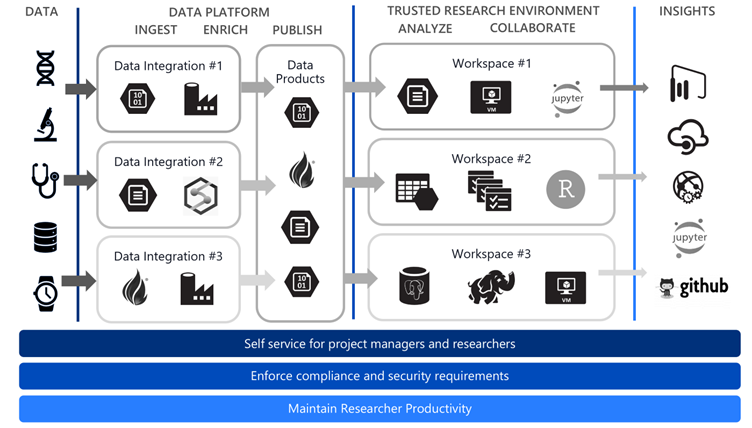

# Azure TRE Overview

## What is Azure TRE?

Across the health industry, be it a pharmaceutical company interrogating clinical trial results, or a public health provider analyzing electronic health records, there is the need to enable researchers, analysts, and developers to work with sensitive data sets.  

Trusted Research Environments (TREs) enable organisations to provide research teams secure access to these data sets along side tooling to ensure a researchers can be productive. Further information on TREs in general can be found in many places, one good resource is [HDR UK](https://www.hdruk.ac.uk/access-to-health-data/trusted-research-environments/).

The Azure Trusted Research Environment project is an accelerator to assist Microsoft customers and partners who want to build out Trusted Research environments on Azure. This project enables authorized users to deploy and configure secure workspaces and researcher tooling without a dependency on IT teams.  

This project is typically implemented alongside a data platform that provides research ready datasets to TRE workspaces:

TREs are not “one size fits all”, hence although the Azure TRE has a number of out of the box features, the project has been built be extensible, and hence tooling and data platform agnostic.

Core features include:

- Self-service for administrators – workspace creation and administration
- Self-service for research teams – research tooling creation and administration
- Package and repository mirroring
- Extensible architecture - build your own service templates as required
- Azure Active Directory integration
- Airlock
- Cost reporting
- Ready to workspace templates including:
  - Restricted with data exfiltration control
  - Unrestricted for open data
- Ready to go workspace service templates including:
  - Virtual Desktops: Windows, Linux
  - AzureML (Jupyter, R Studio, VS Code)
  - ML Flow, Gitea
